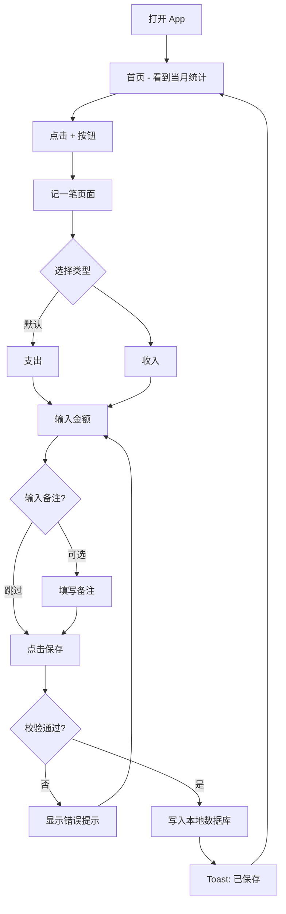
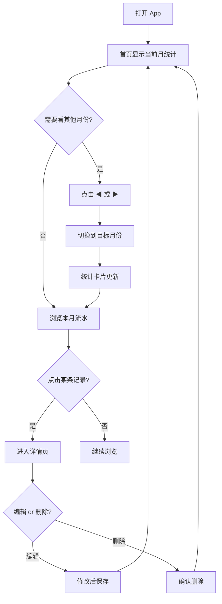

# 简记 — 轻量记账应用产品需求文档（PRD）

| 项目 | 内容 |
|------|------|
| **文档版本** | v1.0 |
| **产品名称** | 简记（暂定名） |
| **文档日期** | 2026-05-23 |
| **文档状态** | 初稿 |
| **产品类型** | 个人收支记账 Web / 移动端应用 |

---

## 目录

1. [产品概述与目标用户](#1-产品概述与目标用户)
2. [详细功能列表](#2-详细功能列表)
3. [功能优先级](#3-功能优先级)
4. [界面设计要求](#4-界面设计要求)
5. [技术栈建议](#5-技术栈建议)
6. [非功能性需求](#6-非功能性需求)
7. [数据模型](#7-数据模型)
8. [用户流程](#8-用户流程)
9. [验收标准](#9-验收标准)
10. [风险与约束](#10-风险与约束)
11. [里程碑计划](#11-里程碑计划)
12. [附录](#12-附录)

---

## 1. 产品概述与目标用户

### 1.1 产品概述

「简记」是一款面向个人用户的轻量记账应用。产品核心目标是让用户在 **3 秒内完成一笔收支记录**，并能 **快速查看当月收支统计**。

产品遵循「够用就好」的设计原则：

- **做**：快速记一笔、看本月花了多少、查历史流水
- **不做**：复杂理财、多人账本、发票 OCR、股票基金、社交分享

一句话定位：**打开即记，记完即走，每月心中有数。**

### 1.2 背景与动机

现有记账 App 普遍存在以下问题：

| 问题 | 表现 |
|------|------|
| 功能过载 | 预算、账户、标签、报表、社区等功能堆叠，学习成本高 |
| 记录路径长 | 记一笔需要 5–8 步操作，用户难以坚持 |
| 数据焦虑 | 过度强调「理财规划」，反而让记账新手产生压力 |
| 启动慢 | 打开 App 需要登录、加载，错过即时记录时机 |

「简记」从最小可用场景出发，只解决最高频的两个需求：**记** 和 **看**。

### 1.3 产品目标

#### 短期目标（MVP，4 周内）

- 新用户 30 秒内完成第一笔记账
- 首页展示当月收入、支出、结余
- 支持按月份浏览历史流水
- 数据本地持久化，刷新不丢失

#### 中期目标（v1.x，3 个月内）

- 7 日留存率 > 40%
- 用户平均每日记账 ≥ 1 笔
- 支持基础分类，用户能了解「钱花在哪」

#### 长期目标（v2.x，6 个月+）

- 可选云同步，换设备不丢数据
- 简单趋势图（近 6 个月支出走势）
- 支持数据导出备份

### 1.4 成功指标（KPI）

| 指标 | MVP 目标 | v1.x 目标 |
|------|----------|-----------|
| 首次记账完成时间 | ≤ 30 秒 | ≤ 15 秒 |
| 记一笔操作步数 | ≤ 3 步 | ≤ 2 步 |
| 7 日留存 | — | ≥ 40% |
| 页面首屏加载 | ≤ 2 秒 | ≤ 1 秒 |
| 崩溃率 | < 0.1% | < 0.05% |

### 1.5 目标用户

#### 主要用户（Primary Persona）

**画像 A：年轻上班族「小林」**

- 年龄：25 岁，互联网从业者
- 收入：月薪 8k–15k，有固定开支（房租、餐饮、交通）
- 痛点：下载过 3 个记账 App 都放弃了，觉得太复杂
- 期望：花 5 秒记一笔，月底看看总共花了多少
- 使用场景：付款后立即打开 App 记一笔；月末回顾消费

**画像 B：大学生「小周」**

- 年龄：20 岁，在读本科
- 收入：父母给的生活费 + 兼职收入
- 痛点：生活费有限，经常月底发现钱不够但不知道花哪了
- 期望：简单记录每笔支出，知道本月还剩多少
- 使用场景：食堂/网购付款后随手记；周末查看本周花费

**画像 C：记账新手「王姐」**

- 年龄：35 岁，非技术背景
- 痛点：从未坚持过记账，被复杂界面劝退
- 期望：界面简单、字大、操作直观，不需要学习
- 使用场景：每天记 1–2 笔主要支出；每月 1 号看上月总结

#### 次要用户（Secondary Persona）

| 画像 | 需求 |
|------|------|
| 自由职业者 | 收入不稳定，需分别记录多笔收入和支出 |
| 极简主义者 | 只关心总额，不需要分类和标签 |
| 临时记账者 | 某段时间（如旅行、装修）集中使用 |

#### 非目标用户（明确排除）

- 需要多账户、多币种管理的用户
- 需要家庭/shared 账本的用户
- 需要专业财务报表的小微企业主
- 需要投资理财管理的用户

---

## 2. 详细功能列表

### 2.1 功能架构总览

```
简记
├── 首页（统计 + 快捷记账）
├── 记一笔（新增收支）
├── 流水列表（按日/月查看）
├── 记录详情（查看 / 编辑 / 删除）
└── 设置（可选，MVP 极简）
```

### 2.2 功能详述

#### F01 — 快捷记一笔

| 属性 | 说明 |
|------|------|
| **功能描述** | 用户通过首页浮动按钮或快捷入口，快速新增一条收入或支出记录 |
| **必填字段** | 类型（收入/支出）、金额 |
| **选填字段** | 备注（MVP）；分类（v1.1） |
| **默认值** | 类型默认「支出」；日期默认「今天」；时间默认「当前时刻」 |
| **交互要求** | 金额输入框自动聚焦；支持数字键盘；保存后 Toast 提示并返回首页 |
| **校验规则** | 金额 > 0；金额 ≤ 999,999.99；最多两位小数 |
| **边界情况** | 金额为 0 或空时禁止保存；超长备注截断至 100 字 |

**记一笔流程（MVP）：**

```
选择类型（收入/支出）→ 输入金额 → [可选] 输入备注 → 点击保存
```

#### F02 — 当月统计概览

| 属性 | 说明 |
|------|------|
| **功能描述** | 首页顶部卡片展示当前选中月份的收入、支出、结余 |
| **计算公式** | 结余 = 收入合计 − 支出合计 |
| **展示内容** | 本月收入（绿色）、本月支出（红色）、本月结余（主色） |
| **交互要求** | 数字使用千分位格式（如 12,345.67）；点击可切换月份 |
| **刷新时机** | 新增/编辑/删除记录后实时更新 |

#### F03 — 月份切换

| 属性 | 说明 |
|------|------|
| **功能描述** | 用户可查看任意历史月份的统计数据和流水 |
| **交互方式** | 左右箭头切换上/下月；或点击月份弹出月份选择器 |
| **限制** | 最早可查看有数据的月份；不可选择未来月份 |
| **联动** | 切换月份后，统计卡片和流水列表同步更新 |

#### F04 — 流水列表

| 属性 | 说明 |
|------|------|
| **功能描述** | 按日期分组展示当前月份的所有收支记录 |
| **列表项内容** | 类型图标、备注（无备注显示「未命名」）、金额、时间 |
| **排序规则** | 按日期倒序；同一天内按时间倒序 |
| **空状态** | 显示「本月暂无记录，点击 + 记一笔」引导文案 |
| **交互** | 点击单条记录进入详情页；支持下拉刷新（移动端） |

#### F05 — 记录详情 / 编辑 / 删除

| 属性 | 说明 |
|------|------|
| **功能描述** | 查看单条记录完整信息，支持编辑和删除 |
| **展示字段** | 类型、金额、日期、时间、备注、创建时间 |
| **编辑** | 可修改所有字段，保存后更新列表和统计 |
| **删除** | 二次确认后删除，删除后更新统计 |
| **限制** | 不可批量删除（MVP） |

#### F06 — 数据本地存储

| 属性 | 说明 |
|------|------|
| **功能描述** | 所有记录保存在本地，关闭浏览器/App 后数据不丢失 |
| **存储方式** | 浏览器 IndexedDB 或 localStorage（MVP）；SQLite（原生 App） |
| **数据安全** | 不上传服务器（MVP）；用户数据仅存本机 |

#### F07 — 分类管理（v1.1）

| 属性 | 说明 |
|------|------|
| **功能描述** | 记一笔时可选择预设分类，便于了解消费结构 |
| **支出默认分类** | 餐饮、交通、购物、娱乐、居住、医疗、教育、其他 |
| **收入默认分类** | 工资、兼职、理财、红包、其他 |
| **交互** | 记一笔页展示分类图标网格，点击选中；默认「其他」 |
| **统计联动** | 首页增加「本月分类占比」简单饼图或条形图 |

#### F08 — 搜索记录（v1.2）

| 属性 | 说明 |
|------|------|
| **功能描述** | 按备注关键词或金额搜索历史记录 |
| **搜索范围** | 全部历史记录 |
| **交互** | 流水页顶部搜索框，实时过滤 |

#### F09 — 数据导出（v1.2）

| 属性 | 说明 |
|------|------|
| **功能描述** | 将记账数据导出为 CSV 文件 |
| **导出字段** | 日期、时间、类型、分类、金额、备注 |
| **范围** | 当前月份 / 全部数据 |

#### F10 — 云同步（v2.0）

| 属性 | 说明 |
|------|------|
| **功能描述** | 登录账号后，数据自动同步到云端 |
| **前提** | 需要用户注册/登录体系 |
| **冲突策略** | 以最新修改时间为准 |
| **离线支持** | 离线可记账，联网后自动同步 |

#### F11 — 趋势分析（v2.0）

| 属性 | 说明 |
|------|------|
| **功能描述** | 展示近 6 个月支出/收入折线图 |
| **维度** | 月度总支出、月度总收入 |
| **位置** | 独立「统计」Tab 或首页底部卡片 |

#### F12 — 设置页（v1.1）

| 属性 | 说明 |
|------|------|
| **功能描述** | 应用基础设置 |
| **包含项** | 货币符号（默认 ¥）、主题（浅色/深色）、清除全部数据（需二次确认）、关于 |

---

## 3. 功能优先级

### 3.1 优先级定义

| 级别 | 含义 |
|------|------|
| **P0** | MVP 必须交付，缺少则产品不可用 |
| **P1** | 第一版增强，显著提升体验 |
| **P2** | 第二版功能，完善产品生态 |
| **P3** | 远期规划，视用户反馈决定 |

### 3.2 MVP（v0.1）— P0 功能

> 目标：4 周内交付，验证「快速记账 + 月度统计」核心价值。

| 编号 | 功能 | 说明 |
|------|------|------|
| F01 | 快捷记一笔 | 收入/支出 + 金额 + 可选备注 |
| F02 | 当月统计概览 | 收入、支出、结余三数卡片 |
| F03 | 月份切换 | 左右切换月份 |
| F04 | 流水列表 | 按日分组展示 |
| F05 | 记录编辑/删除 | 单条 CRUD |
| F06 | 本地数据存储 | IndexedDB / localStorage |

**MVP 不包含：**

- 用户登录/注册
- 分类体系
- 图表分析
- 数据导出
- 云同步
- 多账本

### 3.3 v1.0 — P1 功能

> 目标：MVP 上线后 4–6 周，提升留存和使用深度。

| 编号 | 功能 | 说明 |
|------|------|------|
| F07 | 分类管理 | 预设分类 + 分类占比统计 |
| F12 | 设置页 | 主题切换、清除数据 |
| — | 体验优化 | 手势滑动切换月份、键盘快捷输入 |
| — | 空状态/引导 | 首次使用引导页（3 步介绍） |

### 3.4 v1.x — P2 功能

> 目标：3 个月内，满足进阶用户需求。

| 编号 | 功能 | 说明 |
|------|------|------|
| F08 | 搜索记录 | 关键词 + 金额搜索 |
| F09 | 数据导出 | CSV 导出 |
| — | 自定义分类 | 用户可增删分类 |
| — | 预算提醒 | 设置月度支出上限，接近时提醒 |
| — | PWA 支持 | 可添加到主屏幕，离线可用 |

### 3.5 v2.0 — P3 功能

> 目标：6 个月+，构建完整产品能力。

| 编号 | 功能 | 说明 |
|------|------|------|
| F10 | 云同步 | 账号体系 + 多设备同步 |
| F11 | 趋势分析 | 6 个月收支折线图 |
| — | 多账本 | 如「日常」「旅行」独立账本 |
| — | 周期性记账 | 自动记录房租等固定支出 |
| — | 数据导入 | 从 CSV / 其他 App 导入 |

### 3.6 功能路线图

```
v0.1 MVP          v1.0 增强         v1.x 完善         v2.0 完整
─────────         ─────────         ─────────         ─────────
记一笔            分类              搜索              云同步
月度统计          分类占比          导出              趋势图
月份切换          设置/主题         自定义分类        多账本
流水列表          首次引导          预算提醒          周期记账
编辑/删除                           PWA
本地存储
```

---

## 4. 界面设计要求

### 4.1 设计原则

| 原则 | 说明 |
|------|------|
| **极简** | 每屏最多 1 个主要操作，减少视觉干扰 |
| **快速** | 记一笔页面打开即聚焦金额输入框 |
| **清晰** | 收入绿色、支出红色，色彩语义一致 |
| **友好** | 大按钮、大字体，适老化友好 |
| **一致** | 全应用统一圆角、间距、色彩体系 |

### 4.2 信息架构

```
┌─────────────────────────────────┐
│           首页（默认）            │
│  ┌───────────────────────────┐  │
│  │   月份切换  ◀ 2026年5月 ▶  │  │
│  │   收入    支出    结余     │  │
│  │  ¥8000  ¥5230  ¥2770     │  │
│  └───────────────────────────┘  │
│                                 │
│  5月23日 周五                    │
│  ├ 🍜 午餐           -¥35.00   │
│  ├ 🚇 地铁            -¥6.00   │
│  └ 💰 兼职收入       +¥200.00  │
│                                 │
│  5月22日 周四                    │
│  ├ 🛒 超市           -¥89.50   │
│  └ ...                          │
│                                 │
│              [  +  ]            │  ← 浮动按钮
└─────────────────────────────────┘

┌─────────────────────────────────┐
│         记一笔（弹层/新页）       │
│                                 │
│     [ 支出 ]    [ 收入 ]        │  ← 类型切换
│                                 │
│         ¥ 0.00                  │  ← 大号金额输入
│                                 │
│     备注：午餐（可选）           │
│                                 │
│         [ 保 存 ]               │
└─────────────────────────────────┘
```

### 4.3 页面清单

| 页面 | 路由 | MVP | 说明 |
|------|------|-----|------|
| 首页 | `/` | ✅ | 统计 + 流水列表 |
| 记一笔 | `/add` 或弹层 | ✅ | 新增记录 |
| 记录详情 | `/record/:id` | ✅ | 查看/编辑/删除 |
| 统计 | `/stats` | v1.0 | 分类占比 |
| 设置 | `/settings` | v1.1 | 主题、清除数据 |

### 4.4 视觉规范

#### 色彩

| 用途 | 色值 | 说明 |
|------|------|------|
| 主色 | `#2563EB` | 按钮、链接、结余 |
| 收入色 | `#16A34A` | 收入金额、收入标签 |
| 支出色 | `#DC2626` | 支出金额、支出标签 |
| 背景色 | `#F9FAFB` | 页面背景（浅色模式） |
| 卡片背景 | `#FFFFFF` | 统计卡片、列表项 |
| 文字主色 | `#111827` | 标题、金额 |
| 文字辅色 | `#6B7280` | 日期、备注 |
| 分割线 | `#E5E7EB` | 列表分隔 |

#### 字体

| 元素 | 大小 | 字重 |
|------|------|------|
| 统计大数字 | 28–32px | Bold |
| 列表金额 | 16–18px | Semibold |
| 标题 | 18px | Semibold |
| 正文 | 14–16px | Regular |
| 辅助文字 | 12–13px | Regular |

#### 间距与圆角

- 页面边距：16px
- 卡片内边距：16–20px
- 卡片圆角：12px
- 按钮圆角：8px（普通）/ 50%（浮动按钮）
- 列表项高度：≥ 56px（便于点击）

### 4.5 关键交互说明

| 交互 | 行为 |
|------|------|
| 点击「+」按钮 | 打开记一笔页面/弹层，金额输入框自动聚焦 |
| 类型切换 | 支出/收入 Tab 切换，选中态高亮 |
| 保存成功 | Toast「已保存」→ 自动返回首页 → 列表顶部显示新记录 |
| 删除记录 | 弹窗确认「确定删除这条记录？」→ 确认后删除 |
| 切换月份 | 点击 ◀ ▶ 箭头；无数据月份显示空状态 |
| 长按记录（v1.0） | 弹出快捷菜单：编辑 / 删除 |

### 4.6 响应式适配

| 设备 | 布局策略 |
|------|----------|
| 手机（< 768px） | 单列布局，底部浮动 + 按钮，全宽卡片 |
| 平板（768–1024px） | 居中限宽 480px，模拟手机体验 |
| 桌面（> 1024px） | 居中限宽 420px，左右留白，可键盘操作 |

### 4.7 空状态与异常状态

| 状态 | 展示 |
|------|------|
| 本月无记录 | 插图 + 「本月还没有记录」+ 「记一笔」按钮 |
| 首次使用 | 3 步引导：记一笔 → 看统计 → 查流水 |
| 加载中 | 骨架屏（统计卡片 + 列表占位） |
| 存储失败 | Toast「保存失败，请重试」 |
| 金额无效 | 输入框下方红字提示「请输入有效金额」 |

---

## 5. 技术栈建议

### 5.1 推荐方案：Web 优先（PWA）

适合快速验证 MVP，跨平台（手机浏览器 + 桌面 + 可安装到主屏幕）。

| 层级 | 技术选型 | 理由 |
|------|----------|------|
| **框架** | React + TypeScript 或 Vue 3 + TypeScript | 组件化、生态成熟、类型安全 |
| **构建** | Vite | 启动快、HMR 快、配置简单 |
| **样式** | Tailwind CSS | 快速实现响应式、一致的设计系统 |
| **状态管理** | Zustand 或 Pinia | 轻量，适合小型应用 |
| **本地存储** | IndexedDB（via Dexie.js） | 容量大、结构化查询、异步不阻塞 UI |
| **路由** | React Router / Vue Router | 标准 SPA 路由 |
| **图表（v1.0+）** | Chart.js 或 ECharts | 轻量饼图/折线图 |
| **PWA（v1.x）** | vite-plugin-pwa | 离线缓存、可安装 |
| **部署** | Vercel / Netlify / GitHub Pages | 免费、自动 CI/CD |

### 5.2 备选方案：原生移动端

若目标用户主要在手机端且需要更好的原生体验。

| 层级 | 技术选型 | 理由 |
|------|----------|------|
| **跨平台** | React Native + Expo 或 Flutter | 一套代码 iOS + Android |
| **本地存储** | SQLite（expo-sqlite / sqflite） | 原生性能、结构化 |
| **状态管理** | Zustand / Riverpod | 同上 |

### 5.3 备选方案：纯静态（最快 MVP）

若追求极致简单、零依赖。

| 层级 | 技术选型 | 理由 |
|------|----------|------|
| **前端** | 原生 HTML + CSS + JavaScript | 无构建步骤，双击即用 |
| **存储** | localStorage | 数据量小（< 5000 条）足够 |
| **限制** | 不适合复杂查询和大量数据 | — |

### 5.4 后端（v2.0 云同步时才需要）

| 层级 | 技术选型 | 理由 |
|------|----------|------|
| **运行时** | Node.js + Express 或 Python FastAPI | 轻量 API |
| **数据库** | PostgreSQL 或 SQLite | 关系型，适合结构化记账数据 |
| **认证** | JWT + 邮箱/手机验证码 | 简单登录 |
| **部署** | Railway / Fly.io / 云服务器 | 低成本起步 |

### 5.5 项目结构建议（Web 方案）

```
expense-tracker/
├── docs/
│   └── PRD.md                 # 本文档
├── public/
│   └── icons/                 # PWA 图标
├── src/
│   ├── components/            # UI 组件
│   │   ├── StatCard.tsx       # 统计卡片
│   │   ├── RecordList.tsx     # 流水列表
│   │   ├── RecordItem.tsx     # 单条记录
│   │   ├── AddRecordForm.tsx  # 记一笔表单
│   │   └── MonthPicker.tsx    # 月份选择
│   ├── pages/                 # 页面
│   │   ├── Home.tsx
│   │   ├── AddRecord.tsx
│   │   └── RecordDetail.tsx
│   ├── stores/                # 状态管理
│   │   └── recordStore.ts
│   ├── db/                    # 数据层
│   │   └── index.ts           # Dexie 数据库定义
│   ├── utils/                 # 工具函数
│   │   ├── format.ts          # 金额/日期格式化
│   │   └── calc.ts            # 统计计算
│   ├── types/                 # 类型定义
│   │   └── record.ts
│   ├── App.tsx
│   └── main.tsx
├── index.html
├── package.json
├── tsconfig.json
├── vite.config.ts
└── tailwind.config.js
```

### 5.6 技术选型决策矩阵

| 维度 | Web (React) | 原生 (RN/Flutter) | 纯静态 |
|------|-------------|-------------------|--------|
| 开发速度 | ⭐⭐⭐⭐ | ⭐⭐⭐ | ⭐⭐⭐⭐⭐ |
| 跨平台 | ⭐⭐⭐⭐⭐ | ⭐⭐⭐⭐ | ⭐⭐⭐⭐⭐ |
| 用户体验 | ⭐⭐⭐ | ⭐⭐⭐⭐⭐ | ⭐⭐⭐ |
| 可扩展性 | ⭐⭐⭐⭐⭐ | ⭐⭐⭐⭐ | ⭐⭐ |
| 部署成本 | 免费 | 需应用商店 | 免费 |
| **推荐阶段** | **MVP + v1.x** | v2.0 若需原生 | 极速原型 |

**结论：MVP 阶段推荐 React + Vite + Tailwind + Dexie.js 的 Web 方案。**

---

## 6. 非功能性需求

### 6.1 性能

| 指标 | 要求 | 测量方式 |
|------|------|----------|
| 首屏加载时间 | ≤ 2 秒（4G 网络） | Lighthouse |
| 记一笔保存响应 | ≤ 200ms | 用户感知 |
| 月份切换响应 | ≤ 300ms | 用户感知 |
| 列表滚动 | 60fps，无卡顿 | 1000 条记录压测 |
| 包体积 | ≤ 500KB（gzip） | 构建产物 |
| 内存占用 | ≤ 50MB | DevTools |

**性能策略：**

- 流水列表虚拟滚动（> 200 条时）
- 统计数据增量计算，避免全量遍历
- IndexedDB 索引：`date` 字段索引加速按月查询
- 路由懒加载非首屏页面

### 6.2 安全

| 要求 | 说明 |
|------|------|
| 数据本地化 | MVP 阶段数据仅存用户本机，不上传任何服务器 |
| 无敏感信息采集 | 不收集姓名、手机号、银行卡等 |
| XSS 防护 | 备注等用户输入做 HTML 转义 |
| HTTPS | 部署时必须启用 HTTPS |
| 清除数据 | 提供「清除全部数据」功能，彻底清除 IndexedDB |
| 云同步安全（v2.0） | 传输 TLS 加密；密码 bcrypt 哈希；JWT 过期机制 |

### 6.3 可用性

| 要求 | 说明 |
|------|------|
| 无障碍 | 按钮有 aria-label；色彩对比度 ≥ 4.5:1 |
| 容错 | 所有用户输入有校验和友好错误提示 |
| 防误操作 | 删除需二次确认；清除全部数据需输入确认文字 |
| 离线可用 | MVP 本地存储天然离线；v1.x PWA 离线缓存页面资源 |
| 数据不丢失 | 写入 IndexedDB 成功后才提示「已保存」 |

### 6.4 兼容性

| 平台 | 最低版本 |
|------|----------|
| Chrome | 90+ |
| Safari (iOS) | 14+ |
| Firefox | 90+ |
| Edge | 90+ |
| 微信内置浏览器 | 最新版 |
| 屏幕宽度 | 320px – 1920px |

### 6.5 可维护性

| 要求 | 说明 |
|------|------|
| 代码规范 | ESLint + Prettier 统一风格 |
| 类型安全 | TypeScript strict 模式 |
| 组件化 | 单一职责，可复用 |
| 数据层抽象 | UI 不直接操作 IndexedDB，通过 store/service 层 |
| 版本管理 | Git 分支：main（稳定）、dev（开发） |

### 6.6 数据可靠性

| 要求 | 说明 |
|------|------|
| 存储容量 | 支持至少 10,000 条记录（IndexedDB 上限远超此数） |
| 数据完整性 | 每条记录有唯一 ID（UUID）和 createdAt / updatedAt |
| 备份机制 | v1.2 支持 CSV 导出；v2.0 云同步 |
| 迁移策略 | 数据库 schema 版本号管理，升级时自动迁移 |

---

## 7. 数据模型

### 7.1 记录表（Record）

| 字段 | 类型 | 必填 | 说明 |
|------|------|------|------|
| `id` | string (UUID) | ✅ | 主键 |
| `type` | `'income' \| 'expense'` | ✅ | 收入或支出 |
| `amount` | number | ✅ | 金额，正数，最多 2 位小数 |
| `category` | string | ❌ | 分类 ID（v1.1） |
| `note` | string | ❌ | 备注，最长 100 字 |
| `date` | string (YYYY-MM-DD) | ✅ | 记账日期 |
| `time` | string (HH:mm) | ✅ | 记账时间 |
| `createdAt` | string (ISO 8601) | ✅ | 创建时间 |
| `updatedAt` | string (ISO 8601) | ✅ | 最后修改时间 |

### 7.2 分类表（Category，v1.1）

| 字段 | 类型 | 必填 | 说明 |
|------|------|------|------|
| `id` | string | ✅ | 主键 |
| `name` | string | ✅ | 分类名称 |
| `type` | `'income' \| 'expense'` | ✅ | 适用类型 |
| `icon` | string | ✅ | 图标 emoji 或 icon name |
| `sort` | number | ✅ | 排序权重 |
| `isDefault` | boolean | ✅ | 是否系统预设 |

### 7.3 统计计算逻辑

```javascript
// 某月统计
function getMonthlyStats(records, year, month) {
  const filtered = records.filter(r => {
    const [y, m] = r.date.split('-').map(Number);
    return y === year && m === month;
  });

  const income = filtered
    .filter(r => r.type === 'income')
    .reduce((sum, r) => sum + r.amount, 0);

  const expense = filtered
    .filter(r => r.type === 'expense')
    .reduce((sum, r) => sum + r.amount, 0);

  return {
    income,       // 收入合计
    expense,      // 支出合计
    balance: income - expense  // 结余
  };
}
```

---

## 8. 用户流程

### 8.1 核心流程：记一笔



### 8.2 核心流程：查看月度统计



### 8.3 首次使用流程

```
打开 App → 空状态页（无记录）
       → 引导文案：「开始记录你的第一笔收支吧」
       → 点击「记一笔」
       → 完成第一笔记录
       → 回到首页，看到统计和流水
```

---

## 9. 验收标准

### 9.1 MVP 验收清单

| # | 验收项 | 通过标准 |
|---|--------|----------|
| 1 | 新增支出 | 选择支出 → 输入 50 → 保存 → 首页支出 +50 |
| 2 | 新增收入 | 选择收入 → 输入 3000 → 保存 → 首页收入 +3000 |
| 3 | 结余计算 | 收入 3000、支出 500 → 结余显示 2500 |
| 4 | 备注 | 输入备注「午餐」→ 流水中显示「午餐」 |
| 5 | 月份切换 | 切换到上月 → 统计和流水同步更新 |
| 6 | 编辑记录 | 修改金额 50→80 → 统计同步更新 |
| 7 | 删除记录 | 删除一条 → 统计减少对应金额 |
| 8 | 数据持久化 | 刷新页面 → 数据仍在 |
| 9 | 空状态 | 新月份无数据 → 显示空状态引导 |
| 10 | 输入校验 | 金额为空或 0 → 无法保存，有提示 |
| 11 | 响应式 | 320px 宽度下布局正常 |
| 12 | 性能 | 首屏加载 < 2 秒 |

### 9.2 体验验收

| # | 验收项 | 通过标准 |
|---|--------|----------|
| 1 | 记一笔速度 | 从点击 + 到保存完成 ≤ 10 秒 |
| 2 | 操作步数 | 记一笔（不含备注）≤ 3 步 |
| 3 | 误删保护 | 删除有二次确认 |
| 4 | 金额格式 | 显示千分位，保留 2 位小数 |

---

## 10. 风险与约束

### 10.1 风险

| 风险 | 影响 | 概率 | 应对策略 |
|------|------|------|----------|
| 用户坚持不下来 | 留存低 | 高 | 极致简化流程；推送提醒（v1.x） |
| 本地数据丢失 | 用户信任危机 | 中 | 导出备份（v1.2）；云同步（v2.0） |
| 功能蔓延 | 偏离「简单」定位 | 中 | 严格按优先级排期；新功能需 PRD 评审 |
| 浏览器存储限制 | 数据无法保存 | 低 | IndexedDB 容量充足；降级 localStorage |
| 竞品压力 | 用户选择其他 App | 中 | 差异化：极致简单 + 零注册 |

### 10.2 约束

| 约束 | 说明 |
|------|------|
| 团队规模 | 1–2 人开发 |
| 开发周期 | MVP 4 周 |
| 预算 | 零/serverless 部署 |
| 平台 | Web 优先，暂不做原生 App |
| 语言 | 中文界面 |

---

## 11. 里程碑计划

| 阶段 | 时间 | 交付物 | 关键功能 |
|------|------|--------|----------|
| **M0：设计** | 第 1 周 | 原型图、技术方案 | 线框图、数据模型、项目脚手架 |
| **M1：MVP** | 第 2–3 周 | 可用的 Web App | 记一笔、统计、流水、CRUD、本地存储 |
| **M2：内测** | 第 4 周 | 内测版 | Bug 修复、体验优化、响应式适配 |
| **M3：v1.0** | 第 5–8 周 | 公开发布 | 分类、设置、引导页 |
| **M4：v1.x** | 第 9–12 周 | 功能完善 | 搜索、导出、PWA |
| **M5：v2.0** | 第 13 周+ | 完整版 | 云同步、趋势图 |

---

## 12. 附录

### 12.1 竞品对比

| 功能 | 简记 | 随手记 | Moze | 鲨鱼记账 |
|------|------|--------|------|----------|
| 记一笔速度 | ⭐ 3 秒 | 5 步+ | 4 步 | 3 步 |
| 需要注册 | ❌ | ✅ | ✅ | ✅ |
| 月度统计 | ✅ | ✅ | ✅ | ✅ |
| 分类 | v1.1 | ✅ | ✅ | ✅ |
| 预算 | ❌ | ✅ | ✅ | ✅ |
| 云同步 | v2.0 | ✅ | ✅ | ✅ |
| 图表分析 | v2.0 | ✅ | ✅ | ✅ |
| 复杂程度 | 极简 | 复杂 | 中等 | 简单 |

**简记差异化**：零注册、打开即记、功能最少、专注月度统计。

### 12.2 预设分类（v1.1 参考）

**支出分类：**

| 图标 | 名称 |
|------|------|
| 🍜 | 餐饮 |
| 🚇 | 交通 |
| 🛒 | 购物 |
| 🎮 | 娱乐 |
| 🏠 | 居住 |
| 💊 | 医疗 |
| 📚 | 教育 |
| 📦 | 其他 |

**收入分类：**

| 图标 | 名称 |
|------|------|
| 💰 | 工资 |
| 💼 | 兼职 |
| 📈 | 理财 |
| 🧧 | 红包 |
| 📦 | 其他 |

### 12.3 术语表

| 术语 | 定义 |
|------|------|
| 记一笔 | 新增一条收入或支出记录 |
| 流水 | 按时间排列的记录列表 |
| 结余 | 收入合计减去支出合计 |
| MVP | 最小可行产品，包含最核心功能的第一版 |
| PWA | Progressive Web App，可安装到桌面的 Web 应用 |

### 12.4 修订记录

| 版本 | 日期 | 修改内容 | 作者 |
|------|------|----------|------|
| v1.0 | 2026-05-23 | 初稿，完整 PRD | — |

---

> **文档结束**  
> 下一步：基于本 PRD 进行 UI 原型设计 → 技术脚手架搭建 → MVP 开发。
